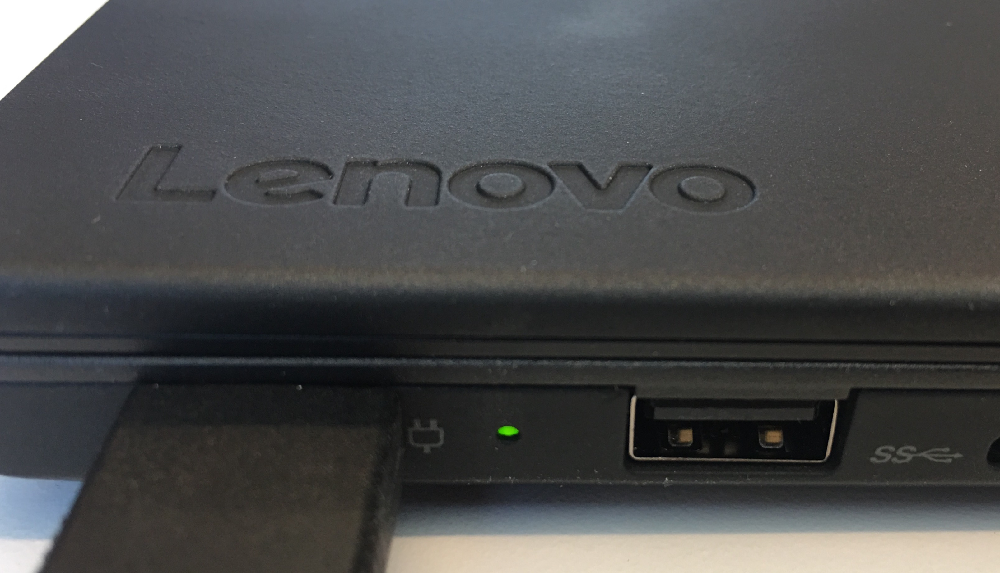
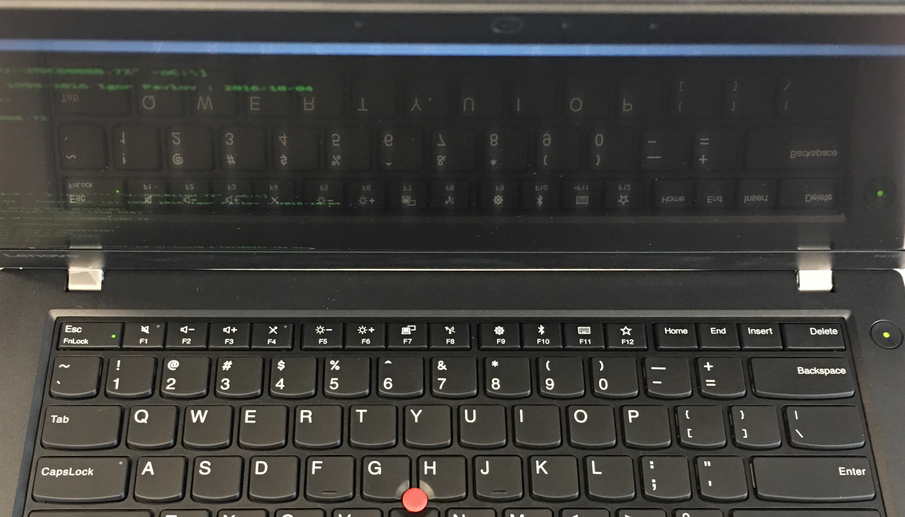

# ThinkPad Review

The Out of Box Experience

#HSLIDE

# T470
##Windu

#HSLIDE

#### Exterior

#HSLIDE

### Exterior
- Lenovo logo debossing integrated well
- Angled bottom experience
- Subtle charging LED
- Hinges tight though robust
- Battery mobility
- Long cord 

#VSLIDE

#HSLIDE

#### Interior

#HSLIDE

### Interior
- No glare with matte screen
- Practical outer grip on B cover
- Large bezel
- Large gap between B-C covers
- Asynchronous plastic cover texture
 
#VSLIDE

Bowing between covers

   
#HSLIDE

#### Experience

#HSLIDE

### Experience
- Power button and fingerprint reader aligned
- Uniform keyboard bevel
- Muted mechanical click 
- Poor sound quality

#VSLIDE

#HSLIDE

# X1 Carbon 
## Yoda

#HSLIDE

### Interior

- Built-in keyboard 
- Economical screen space
- Touchpoint froze upon startup, required updates
- Smooth touchpad texture
